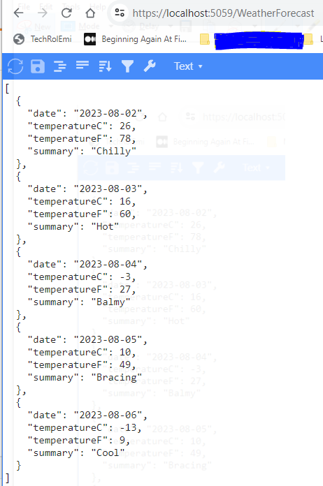

# ASP.NET Core project Created Using dotnet CLI

This project was created using `dotnet` commandline and loaded into VSCode.  There may be a few extentions required such as SwaggerUI, C#, ASP.NET,...

## Create a new ASP.NET Core project

From a powershell terminal, do the followings:

1. *Create a new folder and cd into it*

2. *Verify dotnet templates available, there should be one for `webapi`*

```javascript

dotnet new --list

dotnet new webapi -h

dotnet new webapi -f net6.0 -o myWeatherAPI

cd myWeatherAPI

dotnet dev-certs https --trust

code .
```

At this stage, the project should be loading into VSCode.


3. *Open PowerShell terminal and type:*

```typescript
dotnet run

PS D:\DEVEL\C-SharpProjs\LINKEDIN_TRAINING_2023\.NET7API\hello\myHelloAPI> dotnet run --watch
Building...
info: Microsoft.Hosting.Lifetime[14]
      Now listening on: https://localhost:5059
info: Microsoft.Hosting.Lifetime[0]
      Application started. Press Ctrl+C to shut down.
info: Microsoft.Hosting.Lifetime[0]
      Hosting environment: Development
info: Microsoft.Hosting.Lifetime[0]
      Content root path: D:\DEVEL\C-SharpProjs\LINKEDIN_TRAINING_2023\.NET7API\hello\myHelloAPI
```

The IDE should build and launch the application via the project profiles tag for    `localhost:port` as specified in `Properties/launchSettings.json`

eg.
```json
    "http": {
      "commandName": "Project",
      "dotnetRunMessages": true,
      "launchBrowser": true,
      "launchUrl": "swagger",
      "applicationUrl": "https://localhost:5059",
      "environmentVariables": {
        "ASPNETCORE_ENVIRONMENT": "Development"
      }
    },
    "https": {
      "commandName": "Project",
      "dotnetRunMessages": true,
      "launchBrowser": true,
      "launchUrl": "swagger",
      "applicationUrl": "https://localhost:7214;http://localhost:5059",
      "environmentVariables": {
        "ASPNETCORE_ENVIRONMENT": "Development"
      }
    },
```

4. *Open the browser to https//localhost:5059/weatherforecast/*

